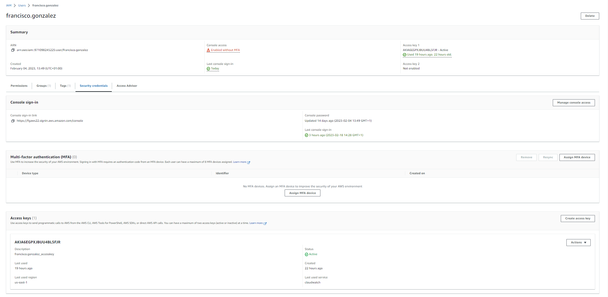
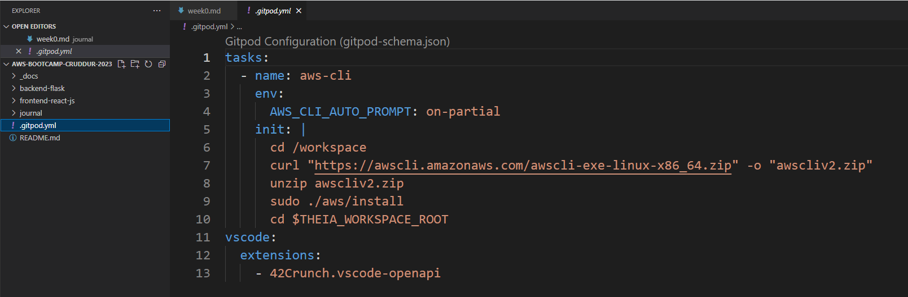
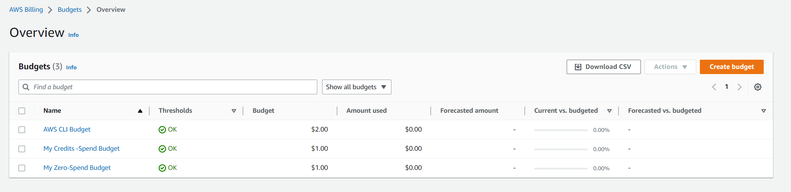
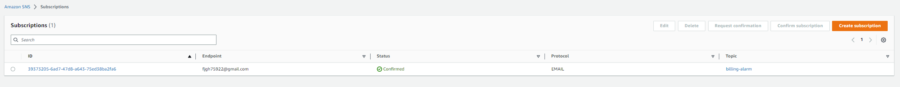

# Week 0 — Billing and Architecture

## Required homework 

1. I saw the livestream video. I recreated the napkin chart  [Napkin Chart](https://lucid.app/lucidchart/e2158356-5716-419b-aa0f-7634ed0ec4bc/edit?viewport_loc=-199%2C-239%2C3072%2C1545%2C0_0&invitationId=inv_5336a2f7-e73e-419d-a115-4add491c08d4)   
2. Created my repository taking the Andrew's as base. (I watched the YT video)
3. Installed the gitpod button. (I watched the YT video)
4. Followed along the Week 0  - Generate Credentials, AWS CLI, Budget and Billing Alarm

    4.1. Generate user credential and created and access key for this account. 
    4.2. Connected gitpod to AWS using the created credential. 
    4.3. Created Budget both using the GUI and CLI. 
    4.4. Created SNS Topic and suscribed using CLI.
    <p>4.5. Created Cloudwatch Billing alarm using CLI.</p>
    <p>4.6. Following this video i learned about how to use gitpod and how to connect to AWS CLI.</p>
    
5. Followed along the week 0 - Lucid Chart video. Recreated the Logical Diagram [Logical Diagram](https://lucid.app/lucidchart/0ad69eee-355c-4084-870f-5c7ee26c76de/edit?view_items=AioyjiS0eyiT&invitationId=inv_86d210af-0945-4cf9-8fe5-47063a0e66f5)

Useful commands

```
aws --cli-auto-prompt

aws sts get-caller-identity
```

